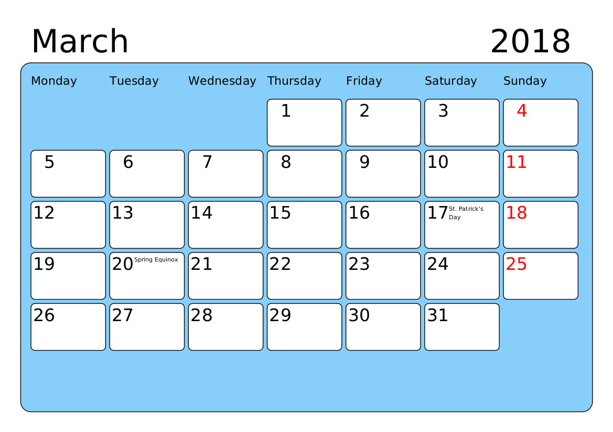

PyCalendarGen 0.9.5
===================

Copyright (C) 2005-2012 Johan Warlander

Purpose
-------

PyCalendarGen generates calendar pages in PDF format for convenient printing,
optionally with a cover page and opposing image pages for each month from a specified directory.

It's possible to select among a few different languages (with customizable 'special days'), and set the starting day of week according to preference.

Installation
------------

Just unpack the archive somewhere useful and install the requirements. It's
highly recommended to set up a virtualenv for isolation:

    cd pycalendargen
    virtualenv venv
    . ./venv/bin/activate
    pip install -r requirements.txt

Then, just run `./PyCalendarGen.py --help` to get started.

_**NOTE:** Make sure to run the command from the installation directory, so it will find the fonts._

Customizing Output
------------------

The program loads special days like holidays, namedays, birthdays etc
from a file called "days_[lang].txt". For example, the language code
for English (American) is `enUS`, so the file would be "days_enUS.txt".

This file MUST be in UTF-8 if it contains non-ASCII characters, and
has the following format:

    DD.MM [color:]Text to appear [ / [color:]Additional line for same day ]

Examples:

-   `25.3 John's Birthday`
    -   show in black, as a single entry, for March 25
-   `25.3 John's Birthday / Start of vacation!`
    -   show in black, as two entries below each other, for March 25
-   `25.3 2:John's Birthday / Start of vacation!`
    -   display _John's Birthday_ in cyan (color code 2), and then on
        the next line _Start of vacation!_ in black
-   `25.3 1:John's Birthday`
    -   display _John's Birthday_ in red (color code 1), and make March
        25 a red day on the calendar page; this is how holidays are tagged
        in the special day file

Dates can be specified relative to Easter, with the `E` prefix:

-   `E-2 Good Friday`
-   `E+0 1:Easter`
-   `E+39 Ascension Day`

Finally, equinoxes and solstices have their own codes:

-   `Tse Spring Equinox`
-   `Tss Summer Solstice`
-   `Tae Autumn Equinox`
-   `Tws Winter Solstice`

_**NOTE:** Consider the existing files as templates to be modified; they may be
outdated, inaccurate, incomplete, or just not adapted to your specific needs._

Disclaimer
----------

This program is free software; you can redistribute it and/or modify
it under the terms of the GNU General Public License as published by
the Free Software Foundation; either version 2 of the License, or
(at your option) any later version.

This program is distributed in the hope that it will be useful,
but WITHOUT ANY WARRANTY; without even the implied warranty of
MERCHANTABILITY or FITNESS FOR A PARTICULAR PURPOSE.  See the
GNU General Public License for more details.

You should have received a copy of the GNU General Public License
along with this program; if not, write to the Free Software
Foundation, Inc., 59 Temple Place, Suite 330, Boston, MA  02111-1307  USA
